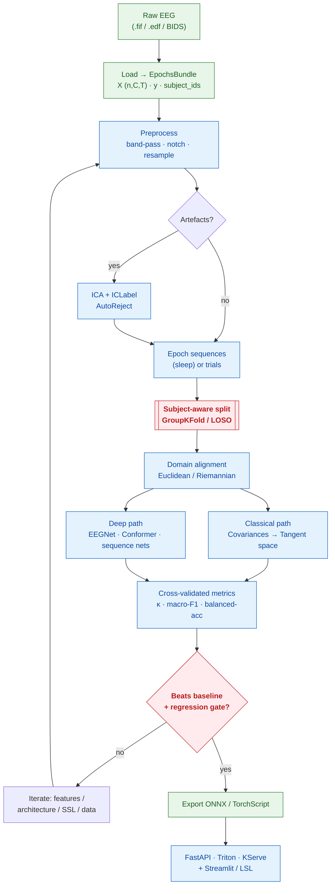
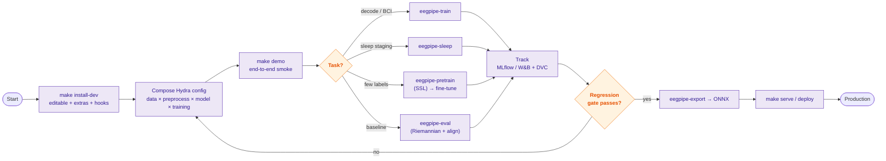
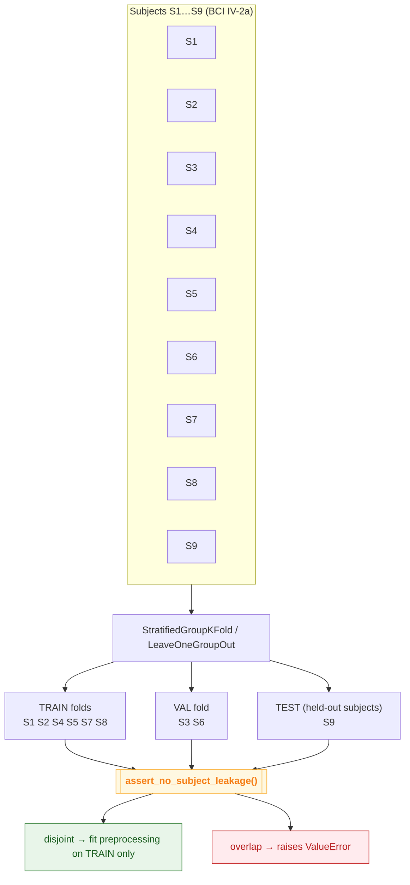
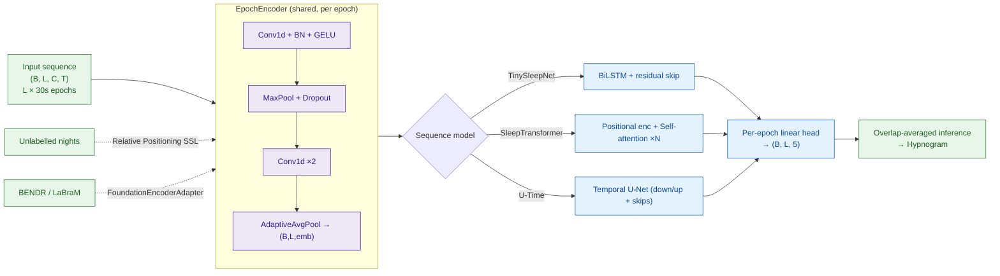
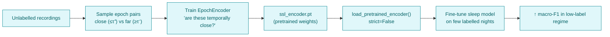
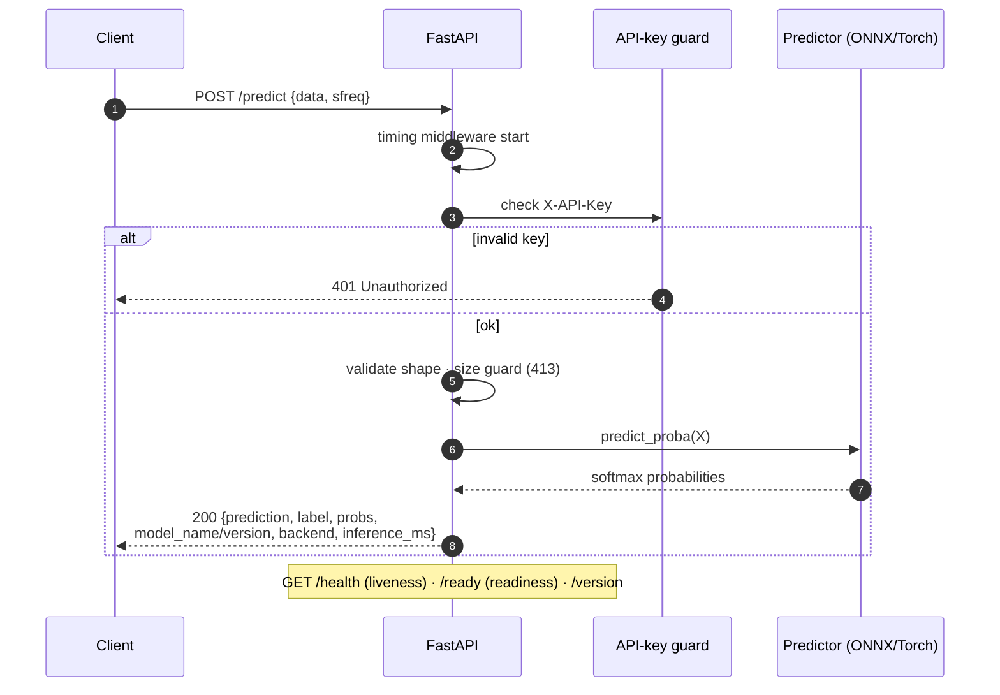
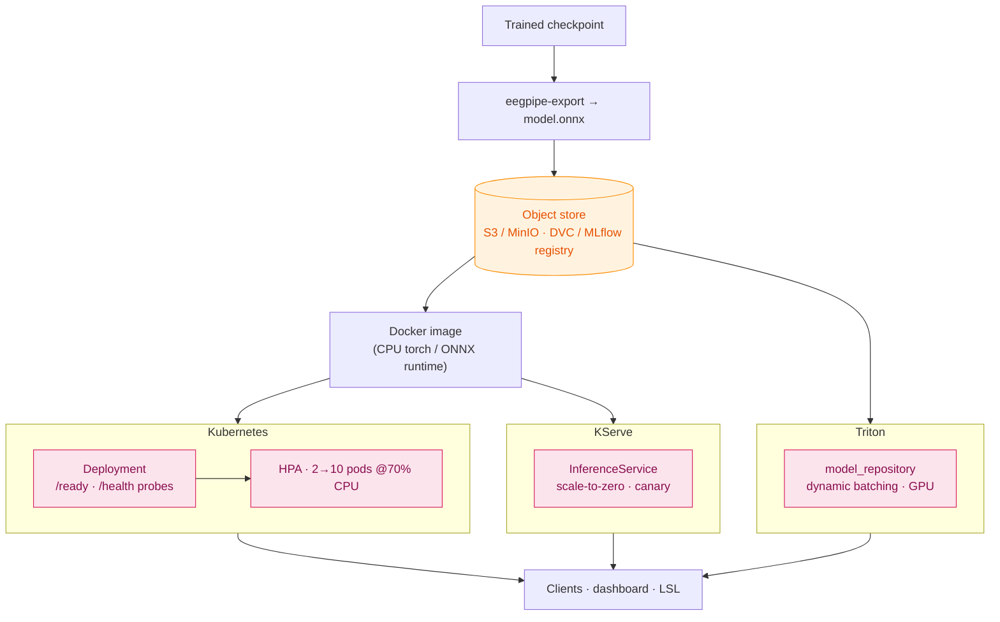

<div align="center">

# eegpipe

### A Production-Grade EEG / BCI Machine-Learning Pipeline

*From exploratory notebooks → a modular, reproducible, deployable deep-learning system for EEG.*


</div>

---

## Table of contents

- [Overview](#overview)
- [Capability matrix](#capability-matrix)
- [System architecture](#system-architecture)
- [The ML pipeline](#the-ml-pipeline)
- [Developer workflow](#developer-workflow)
- [Leakage-safe evaluation](#leakage-safe-evaluation)
- [Sleep-staging model internals](#sleep-staging-model-internals)
- [Self-supervised pretraining & transfer](#self-supervised-pretraining--transfer)
- [Serving & deployment](#serving--deployment)
- [Results & verified outputs](#results--verified-outputs)
- [Quickstart](#quickstart)
- [Configuration (Hydra)](#configuration-hydra)
- [CLI reference](#cli-reference)
- [Project layout](#project-layout)
- [Testing & quality](#testing--quality)
- [License](#license)

---

## Overview

`eegpipe` is a refactor of the original `eeganalysis` notebooks into an installable, tested,
production-ready package. It spans the **entire EEG/BCI lifecycle**: BIDS/MOABB/Sleep-EDF
ingestion → leakage-safe cross-validation → classical (Riemannian) **and** deep
(EEGNet / Conformer / ST-GCN) decoding → sleep-staging sequence models
(BiLSTM / Transformer / U-Time) with self-supervised pretraining and foundation-model transfer
→ interpretability and cross-site domain adaptation → ONNX export, a hardened FastAPI service,
and Triton / KServe / Kubernetes deployment — all under Hydra configs, DVC data versioning,
experiment tracking, unit tests, and CI.

> **Design thesis:** EEG/BCI projects fail in production for predictable reasons — *subject
> data leakage*, configs trapped in notebooks, no experiment provenance, and raw recordings
> committed to git. Every directory here is shaped to make those mistakes *hard to commit*.

---

## Capability matrix

| Domain | What's included | Module |
|---|---|---|
| **Data** | BIDS · MOABB (BCI IV-2a) · Sleep-EDF · MNE-sample, behind one `EpochsBundle` | `data/loaders.py` |
| **Leakage safety** | Subject-aware `GroupKFold` / LOSO / nested CV + leakage assertions | `data/splits.py` |
| **Preprocessing** | Band-pass · notch · resample · **automated ICA (ICLabel)** · AutoReject | `preprocessing/` |
| **Classical features** | **Riemannian** tangent space · wavelets · spectral band-power | `features/` |
| **Deep models** | EEGNet · EEG-Conformer · ST-GCN | `models/` |
| **Sleep sequence models** | TinySleepNet (BiLSTM) · SleepTransformer · U-Time | `models/sleep.py` |
| **Self-supervised** | Relative Positioning pretext + encoder transfer | `models/ssl.py` |
| **Foundation models** | BENDR / LaBraM adapter into the shared encoder slot | `models/foundation.py` |
| **Domain adaptation** | Euclidean Alignment · Riemannian recentering (cross-site) | `adaptation/` |
| **Interpretability** | Integrated-Gradients saliency · attention rollout · confusion matrix | `interpret/` |
| **Real-time** | Lab Streaming Layer (LSL) closed-loop inference | `inference/stream.py` |
| **Serving** | FastAPI (ONNX-first, hardened) · Streamlit dashboard | `serving/`, `dashboard/` |
| **MLOps** | Hydra · MLflow/W&B · DVC pipeline · CI regression gate | `configs/`, `dvc.yaml`, CI |
| **Deployment** | Docker · k8s + HPA · KServe · Triton | `docker/`, `deploy/` |

---

## System architecture

```mermaid
flowchart LR
    subgraph SRC["Data sources"]
        direction TB
        BIDS["EEG-BIDS"]
        MOABB["MOABB · BCI IV-2a"]
        SEDF["Sleep-EDF"]
        SAMP["MNE sample"]
    end

    subgraph CORE["eegpipe core"]
        direction TB
        LOAD["data.loaders<br/>Factory → EpochsBundle"]
        PRE["preprocessing<br/>filter · ICA · AutoReject"]
        SPLIT["data.splits<br/>subject-aware CV"]
        ADAPT["adaptation<br/>Euclidean / Riemannian align"]
        FEAT["features<br/>Riemann · wavelet · spectral"]
        subgraph MZ["models"]
            direction TB
            ENC["EpochEncoder · shared"]
            DEEP["EEGNet · Conformer · ST-GCN"]
            SEQ["TinySleepNet · Transformer · U-Time"]
            SSL["SSL · Relative Positioning"]
            FND["Foundation adapter · BENDR/LaBraM"]
        end
        TRAIN["training<br/>Lightning loops"]
        INTERP["interpret<br/>saliency · attention · CM"]
    end

    subgraph OPS["MLOps"]
        direction TB
        HYDRA["Hydra configs"]
        DVC["DVC · data versioning"]
        MLF["MLflow / W&B"]
        GATE["CI regression gate"]
    end

    subgraph OUT["Serving & apps"]
        direction TB
        EXP["ONNX / TorchScript export"]
        API["FastAPI · /predict"]
        LSL["LSL real-time loop"]
        DASH["Streamlit dashboard"]
    end

    subgraph DEP["Deployment"]
        direction TB
        DOCK["Docker"]
        K8S["k8s + HPA"]
        KS["KServe"]
        TRT["Triton"]
    end

    SRC --> LOAD --> PRE --> SPLIT
    SPLIT --> FEAT --> MZ
    SPLIT --> MZ
    ADAPT --> MZ
    MZ --> TRAIN --> INTERP
    TRAIN --> EXP
    EXP --> API & LSL & DASH
    EXP --> DEP

    HYDRA -. config .-> CORE
    DVC -. versions .-> LOAD
    TRAIN -. metrics .-> MLF
    MLF -. baseline .-> GATE

    classDef src fill:#e3f2fd,stroke:#1976d2,color:#0d47a1;
    classDef core fill:#ede7f6,stroke:#5e35b1,color:#311b92;
    classDef ops fill:#fff3e0,stroke:#fb8c00,color:#e65100;
    classDef out fill:#e8f5e9,stroke:#43a047,color:#1b5e20;
    classDef dep fill:#fce4ec,stroke:#d81b60,color:#880e4f;
    class BIDS,MOABB,SEDF,SAMP src;
    class LOAD,PRE,SPLIT,ADAPT,FEAT,ENC,DEEP,SEQ,SSL,FND,TRAIN,INTERP core;
    class HYDRA,DVC,MLF,GATE ops;
    class EXP,API,LSL,DASH out;
    class DOCK,K8S,KS,TRT dep;
```



---

## The ML pipeline

End-to-end data flow, from raw recording to a served prediction. Stateful steps (ICA,
AutoReject, scalers) are **fit inside each CV fold** — never on the test subject.



---

## Developer workflow

Everything is a composable command. A run is fully specified by *config + seed + data hash*,
so any result is reproducible.



---

## Leakage-safe evaluation

The single most common EEG-ML error is letting epochs from one subject land in both train and
test, inflating accuracy by 10–30 points. `eegpipe` exposes **only** group-aware splitters and
asserts disjointness inside every fold.



---

## Sleep-staging model internals

A 30-second epoch is ambiguous alone — neighbouring epochs disambiguate it. All three sleep
backbones share one `EpochEncoder` and differ only in how they model context *across* epochs
(BiLSTM / self-attention / multi-scale U-Net). Many-to-many: a stage is predicted for **every**
epoch in the input sequence.



> **Class imbalance** (N2 dominates, N1 is rare) is countered three ways at once: inverse-frequency
> class weights, a weighted sampler that oversamples sequences containing rare stages, and an
> optional focal loss. Model selection uses **macro-F1**, never accuracy.

---

## Self-supervised pretraining & transfer

The defining constraint of clinical EEG is *few labels, lots of unlabelled signal*.



---

## Serving & deployment

**Request flow** (FastAPI, ONNX-first backend):



**Deployment topology** — pick the rung you actually need:



---

## Results & verified outputs

> All outputs below are **real** from this repo's verification runs. Deep-model accuracy
> numbers are intentionally **not** quoted as benchmarks here — they depend on your data/run
> and are emitted live to MLflow/`reports/`. The classical numbers shown are from the offline
> **synthetic** smoke (clearly labelled), used to prove the pipeline wiring, not to claim SOTA.

### Repository at a glance

| Metric | Value |
|---|---|
| Python modules (`src/`) | **51** |
| Hydra config files | **17** |
| Test files / CLI entry points | **11 / 6** |
| Deployment manifests | **7** |
| Unit tests | **22 passed**, 18 skipped (optional deps run in CI) |
| AST integrity check | **86 symbols across 32 modules — all present** |

### `make demo` — end-to-end smoke (synthetic, offline)

```text
[ok] data       synthetic X=(800, 3, 3000) subjects=4
[ok] windows    40 sequences of len 20
[ok] split      train=20 test=20 sequences, no subject leakage
[ok] align      per-subject mean-cov deviation from I = 2.61e-07
[ok] classical  macro_f1=0.990 kappa=0.987
[--] deep       torch/lightning not installed (runs in CI / on your machine)
[--] export     needs deep stage + onnx/onnxruntime
[--] hypnogram  needs deep stage (torch)
[ok] gate       [OK] test/macro_f1: baseline=0.0000 current=0.9896 (Δ=+0.9896)
SMOKE DEMO: 6 passed, 3 skipped, 0 failed
```

`reports/smoke_metrics.json` (synthetic baseline, written by the demo):

```json
{ "test/accuracy": 0.99, "test/balanced_accuracy": 0.990,
  "test/macro_f1": 0.990, "test/kappa": 0.987 }
```

### What each stage produces (and its verified status)

| Stage | Module | Output artefact | Verified |
|---|---|---|---|
| Load | `data/loaders.py` | `EpochsBundle` (X, y, subject_ids) | 4 loaders concrete |
| Preprocess | `preprocessing/` | cleaned MNE `Epochs` | pipeline builds & runs |
| Window | `data/sequence.py` | `(n, L)` index windows (no night-crossing) | boundary tests pass |
| Split | `data/splits.py` | disjoint train/val/test indices | leakage asserts pass |
| Align | `adaptation/` | whitened trials (mean-cov → I, dev 2.6e-7) | measured |
| Classical | `features/` | κ / macro-F1 (Riemannian / band-power) | macro-F1 0.99 (synthetic) |
| Deep train | `training/`, `models/` | `.ckpt` + MLflow run | CI / local (needs torch) |
| Interpret | `interpret/` | `reports/confusion.npy` · saliency · attention | plot + logic tested |
| Export | `serving/export.py` | `model.onnx` (dynamic axes) | CI (needs torch+onnx) |
| Serve | `serving/api.py` | `/predict` JSON + latency | health/ready/predict tested |
| Hypnogram | `inference/hypnogram.py` | per-epoch stages + plot | CI (needs torch) |

> **A real find from the real-data path.** Running `make demo REAL=--real` surfaced a bug that
> `py_compile` and import checks had *missed*: a save-time formatter had truncated
> `SleepEDFLoader.load`, leaving the class abstract (it still imported fine). It was fixed, and a
> repo-wide **AST integrity check** now guards against truncation. The PhysioNet download itself is
> firewalled in the build sandbox, so the `--real` path runs on your machine.

---

## Quickstart

```bash
# 1) Environment (Python ≥3.10)
python -m venv .venv && source .venv/bin/activate
make install-dev                     # editable install + all extras + pre-commit

# 2) Prove the whole chain in one command
make demo                            # synthetic, offline (deep stages skip without torch)
make demo REAL=--real                # one real Sleep-EDF night (downloads via MNE)

# 3) Train
eegpipe-train data=bci_iv_2a model=eegnet training.logger=mlflow      # motor-imagery, LOSO-ready
eegpipe-sleep data=sleep_edf model=sleep_transformer training=sleep preprocess=sleep

# 4) Few labels? Pretrain self-supervised, then fine-tune
eegpipe-pretrain data=sleep_edf model=sleep_seqnet training=pretrain preprocess=sleep
eegpipe-sleep    data=sleep_edf model=sleep_seqnet training=sleep    preprocess=sleep \
    model.pretrained_encoder=models_store/ssl_encoder.pt

# 5) Export & serve
eegpipe-export sleep.ckpt sleep.onnx --kind sequence --channels 4 --times 3000 --seq-len 20
EEGPIPE_ONNX=sleep.onnx make serve   # FastAPI → http://localhost:8000/docs
make dashboard                       # Streamlit → http://localhost:8501
```

---

## Configuration (Hydra)

Compose any run from four config groups — no code edits, fully logged:

```bash
eegpipe-<cmd>  data=<…>  preprocess=<…>  model=<…>  training=<…>  [overrides]
```

| Group | Options | Notes |
|---|---|---|
| `data` | `bci_iv_2a` · `sleep_edf` · `sleep_edf_multimodal` · `bids` · `mne_sample` | multimodal adds EOG+EMG (helps REM) |
| `preprocess` | `default` (8–32 Hz) · `sleep` (0.3–35 Hz) | sleep keeps delta/slow-wave bands |
| `model` | `eegnet` · `conformer` · `stgcn` · `sleep_seqnet` · `sleep_transformer` · `utime` · `sleep_foundation` | foundation = BENDR/LaBraM slot |
| `training` | `default` · `sleep` · `pretrain` | sleep selects on macro-F1, weighted sampler |

```bash
# Examples of composition + overrides
eegpipe-sleep data=sleep_edf_multimodal model=utime training=sleep preprocess=sleep
eegpipe-eval  data=bci_iv_2a loso=true align=true            # LOSO + Euclidean Alignment
eegpipe-train model=conformer model.depth=6 training.fast_dev_run=true
eegpipe-train -m model=eegnet,conformer model.lr=1e-4,1e-3   # Optuna/Hydra sweep
```

---

## CLI reference

| Command | Purpose |
|---|---|
| `eegpipe-train` | Train a per-trial decoder (EEGNet/Conformer/ST-GCN), subject-aware CV |
| `eegpipe-sleep` | Train a sleep-staging sequence model (macro-F1 selection) |
| `eegpipe-pretrain` | Self-supervised (Relative Positioning) encoder pretraining |
| `eegpipe-eval` | Leakage-safe Riemannian baseline (+ optional alignment) |
| `eegpipe-export` | Export a checkpoint to ONNX / TorchScript |
| `eegpipe-serve` | Launch the FastAPI inference service |
| `make demo` | End-to-end smoke test (`REAL=--real` for Sleep-EDF) |
| `make dashboard` | Streamlit app (Signals · Topomap · Predict · Hypnogram · Explain) |
| `make regression` | Fail if metrics regressed vs `tests/baseline_metrics.json` |

---

## Project layout

```
eeganalysis/
├── README.md  ROADMAP.md            # this file · the §1–§10 architecture plan
├── pyproject.toml  Makefile         # packaging (extras: dl,features,mlops,serve,export,dev)
├── configs/                         # Hydra groups: data · preprocess · model · training
├── src/eegpipe/
│   ├── data/         loaders (Factory) · sequence windows · subject-aware splits
│   ├── preprocessing/ filters · ICA+ICLabel · AutoReject · pipeline builder
│   ├── features/     riemann · wavelet · spectral
│   ├── adaptation/   Euclidean / Riemannian domain alignment
│   ├── models/       eegnet · conformer · stgcn · sleep · ssl · foundation · base · registry
│   ├── training/     datamodule · train · evaluate · sleep · pretrain
│   ├── inference/    predictor · onnx_predictor · stream (LSL) · hypnogram
│   ├── interpret/    saliency · attention · plots
│   ├── serving/      api (FastAPI) · schemas · export
│   ├── dashboard/    app (Streamlit, 5 tabs)
│   └── utils/        config · logging · seed · metrics
├── scripts/          thin CLI wrappers + smoke_demo + check_regression
├── tests/            pytest (subject-leakage tests are first-class)
├── docker/  deploy/  Dockerfile · compose · k8s + HPA · KServe · Triton
├── dvc.yaml params.yaml             # reproducible data → features → train → eval DAG
└── .github/workflows/ci.yml         # lint · type · test · export-smoke · regression-gate · docker
```

---

## Testing & quality

```bash
make test      # fast unit tests (excludes slow/gpu)
make cov       # full suite + coverage
make lint      # ruff
make type      # mypy
```

- **Subject-leakage tests are first-class** — a grep for `KFold` outside `splits.py` should return nothing.
- Tests needing `torch` / `onnx` / `pyriemann` **skip gracefully** locally and **run in CI**.
- CI (`.github/workflows/ci.yml`): ruff → mypy → pytest+coverage → export import-smoke →
  **model-regression gate** → Docker build.

---

## License

MIT © contributors. See [`ROADMAP.md`](ROADMAP.md) for the full senior-to-junior architecture
review (§1 architecture → §10 end-to-end smoke).

<div align="center"><sub>Built with MNE-Python · PyTorch Lightning · Hydra · MLflow · DVC · FastAPI · ONNX · Streamlit</sub></div>
